# Paper
Using Ising models to represent deep neural networks we can uncover a range of interesting phenomena:
* The density of states shows that structures emerge in the weights after they have been trained – well-trained networks span a much wider range of realizable energies compared to poorly trained ones.
* These structures propagate throughout the entire network and are not observed in individual layers.
* The energy values correlate to performance on tasks, making it possible to distinguish networks based on quality, which is rather difficult without access to data.
* Thermodynamic properties such as specific heat show that trained networks achieve higher critical temperatures than after shuffling.

## Data
Simulations are conducted on a range of pretrained deep neural networks available in [Huggingface](https://huggingface.co/), which cover both encoder- and decoder-based transformers of various sizes or language and vision tasks. The deep neural networks analyzed include: [GPT2](https://huggingface.co/docs/transformers/model_doc/gpt2), [OPT](https://huggingface.co/docs/transformers/model_doc/opt), [Bloom](https://huggingface.co/docs/transformers/model_doc/bloom), [BERT](https://huggingface.co/docs/transformers/model_doc/bert), [BeiT](https://huggingface.co/docs/transformers/model_doc/beit), [DeiT](https://huggingface.co/docs/transformers/model_doc/deit), and [ViT](https://huggingface.co/docs/transformers/model_doc/vit).

This page documents the data from the experiments in the paper, which are organized as follows:
```dos/```<br/>
Density of states of trained and shuffled networks. For each text file, the first column represents the energy $E$ and the second column denotes the density of states $ln g(E)/N$ normalized by the number of spins $N$.

```blocks/```<br/>
Density of states for trained and shuffled networks where Ising models are constructed using a varying number of transformer layers (e.g., `blocks4` means Ising models are constructed from four transformer layers).

```fraction/```<br/>
Density of states for networks where a different fraction of weights are shuffled (e.g., `fraction0.01` means $1$ percentage of values are shuffled).

```accuracy/```<br/>
Accuracy achieved during inference after shuffling weights of the trained networks. For each text file, the first column represents the shuffling fraction $f$ and the second column denotes the task metric (i.e., accuracy for ImageNet, and PPL for the language tasks).

```specificheat/```<br/>
The specific heat computed using the density of states in `dos/`. For each text file, the first column represents the temperature $T$ and the second column denotes the specific heat $C(T)$.

## Density of States
Below are shown the density of states for the various transformers both trained and after their values have been shuffled, representing untrained networks without changing the distribution of weights. It can be observed that well-trained networks span a much wider range of energies that can be realized compared to after shuffling, which represent poorly trained networks. To generate the plots, run `python dos.py` for the different networks.

| | | |
|:-------------------------:|:-------------------------:|:-------------------------:|
| | 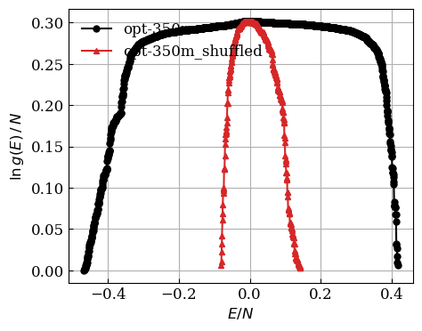|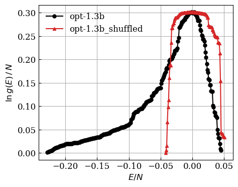|
|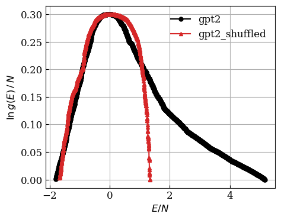 | 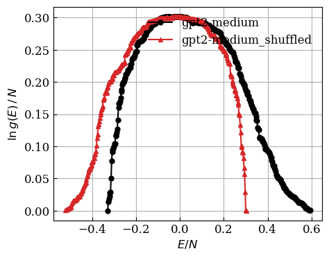|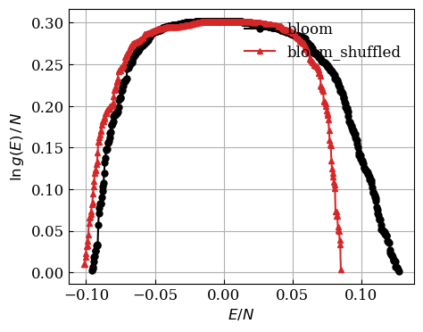|
|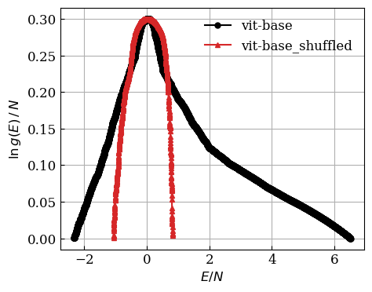 | 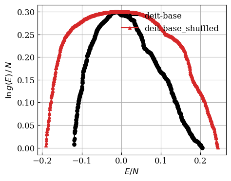|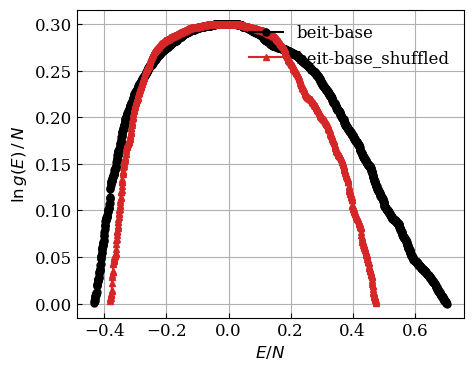|
|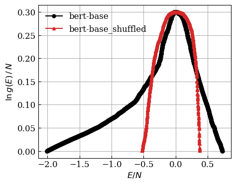 | 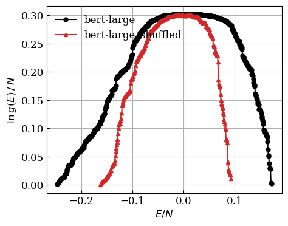| |

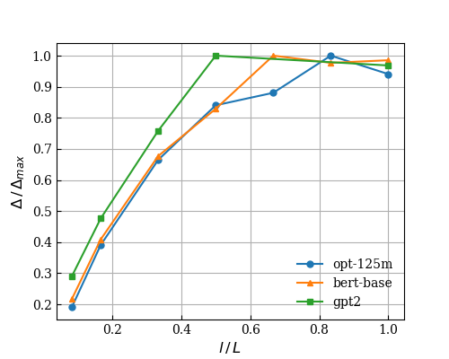

## Structures
Since the same distribution of values is guaranteed through shuffling, differences in the density of states must arise due to structure, or how weights are arranged in a neural network. The question then arises whether these structures exist in a subset of layers. Below are shown the difference in widths of the density of states, $\Delta = W_{train} - W_{shuffled}$ where $W=E_{max}-E_{min}$ , for different number of transformer layers $l$ that participate in the Ising model. From the plot, it can be observed that $W$ increases when adding more layers, which implies that structures appear throughout the entire network rather than in a few layers. To generate the plot, run `python blocks.py`.

## Shuffling and Performance on Tasks
The density of states are compared between networks using different amounts of shuffling. Below are shown the widths $W$ of the density of states for various networks as a function of the fraction $f$ of values being shuffled. The plot shows that $W$ drops rapidly and approaches that of a random network ( $f=1$ ) after more than $20$ percent of the values have been shuffled. We also show the task error $\mathcal{E}$ achieved on tasks for the same networks, which are computed as the relative change in evaluation metrics, $\mathcal{M}$, between trained networks and after shuffling,

$$
\begin{align}
\mathcal{E}=\frac{\|\mathcal{M}_{trained}-\mathcal{M}_{shuffled}\|}{\mathcal{M}_{trained}}\times100
\end{align}
$$

The plots show that $W$ decreases as the task error $\mathcal{E}$ increases, which implies that the density of states correlates to performance on actual tasks. To generate the plots, run `python fraction.py` and `python accuracy.py`.

| | |
|:-------------------------:|:-------------------------:|
|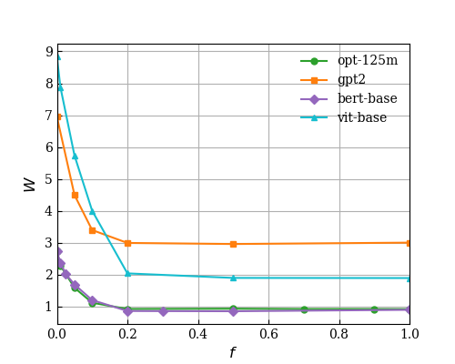 | 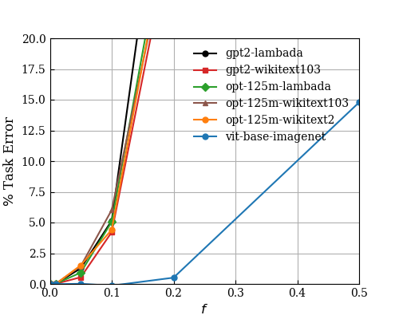|

## Other Thermodynamic Variables: Specific Heat
Lastly, the specific heat $C(T)$ is computed from the density of states for trained and shuffled networks, as shown below. The figure suggests that different networks acquire different specific heat curves, and the critical temperature $T_c$ (i.e., temperature $T$ that maximizes $C(T)$ ) also varies between networks, as well as between trained and shuffled. To generate the plots, run `python specificheat.py` for the different networks.

| | | |
|:-------------------------:|:-------------------------:|:-------------------------:|
|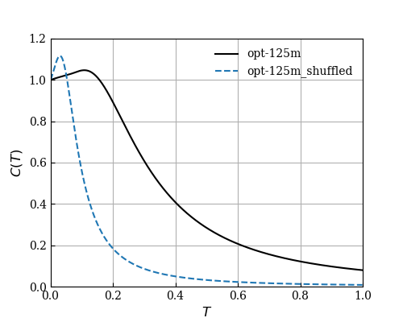 | 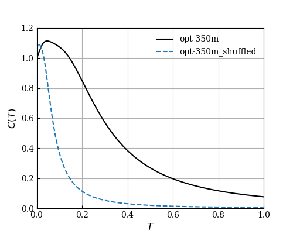|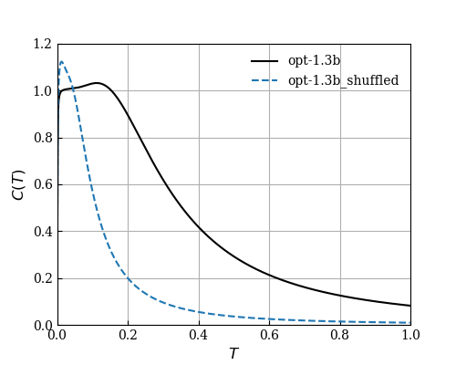|
|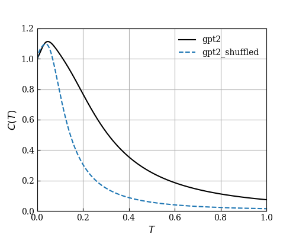 | 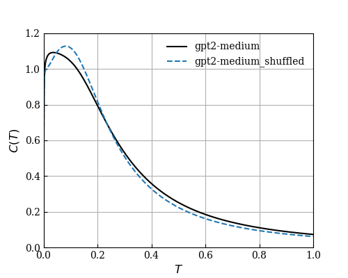|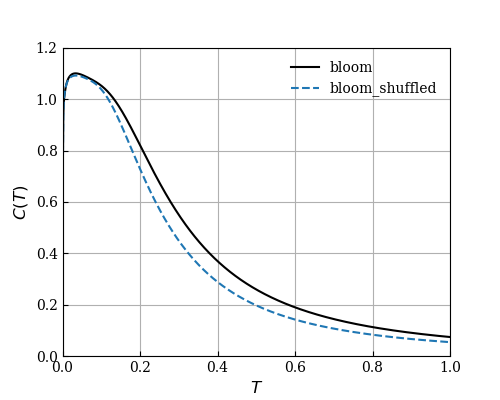|
|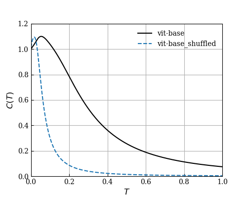 | 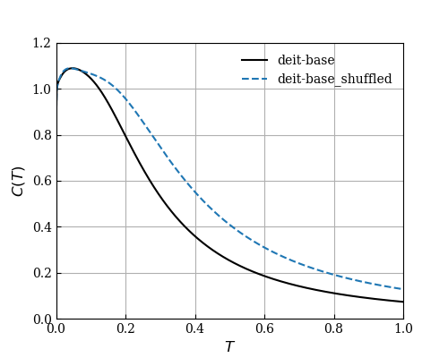|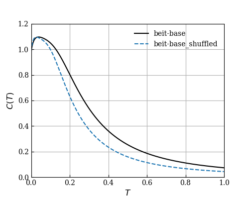|
| | 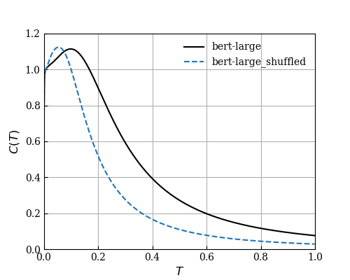| |
